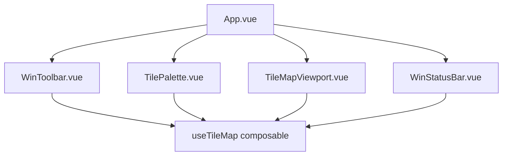

# 组件图（Mermaid）

```mermaid
flowchart TB
  App[App.vue]
  Toolbar[WinToolbar.vue]
  Palette[TilePalette.vue]
  Viewport[TileMapViewport.vue]
  Status[WinStatusBar.vue]
  Store[useTileMap composable]

  App --> Toolbar
  App --> Palette
  App --> Viewport
  App --> Status
  Toolbar --> Store
  Palette --> Store
  Viewport --> Store
  Status --> Store
```
